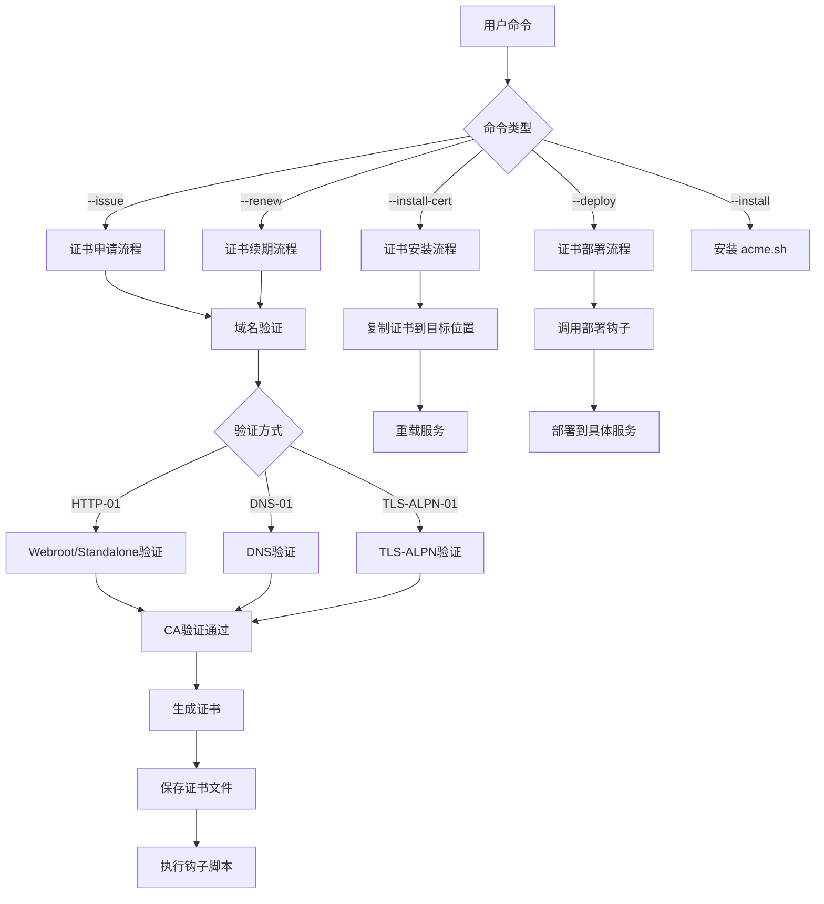
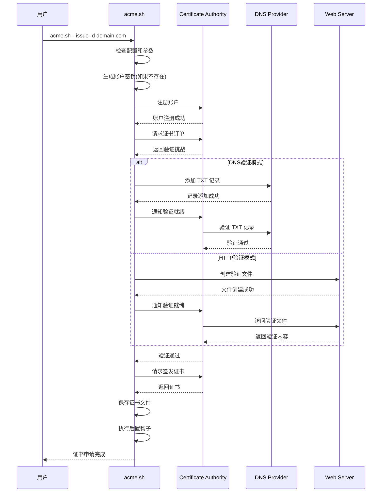
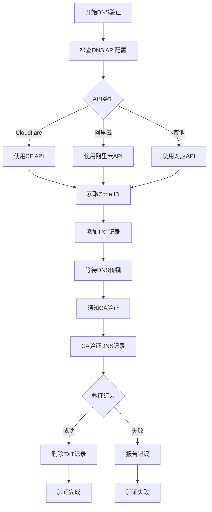
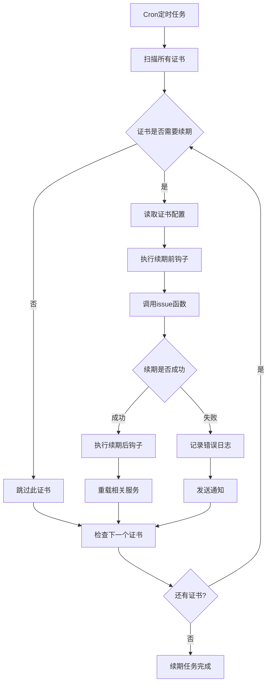
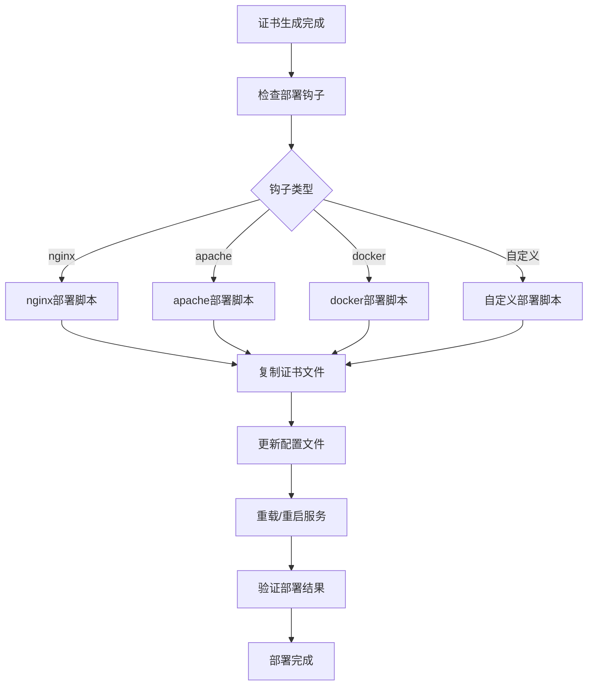

# acme.sh 业务流程图

## 整体架构流程



## 证书申请详细流程



## DNS API 验证流程



## 证书续期流程



## 部署钩子系统



## 主要数据结构

### 证书配置文件结构
```
~/.acme.sh/domain.com/
├── domain.com.conf          # 证书配置
├── domain.com.key           # 私钥
├── domain.com.cer           # 证书
├── ca.cer                   # CA证书
└── fullchain.cer            # 完整证书链
```

### 配置参数
- `Le_Domain`: 主域名
- `Le_Alt`: 备用域名
- `Le_Webroot`: Web根目录
- `Le_PreHook`: 前置钩子
- `Le_PostHook`: 后置钩子
- `Le_RenewHook`: 续期钩子
- `Le_DeployHook`: 部署钩子

## 关键业务逻辑

1. **ACME协议实现**: 完整实现 RFC 8555 ACME 协议
2. **多CA支持**: 支持 Let's Encrypt, ZeroSSL, SSL.com 等多个CA
3. **自动化续期**: 默认60天自动续期机制
4. **灵活验证**: 支持多种域名验证方式
5. **钩子系统**: 丰富的钩子机制支持自动化部署
6. **跨平台**: 支持多种操作系统和Shell环境